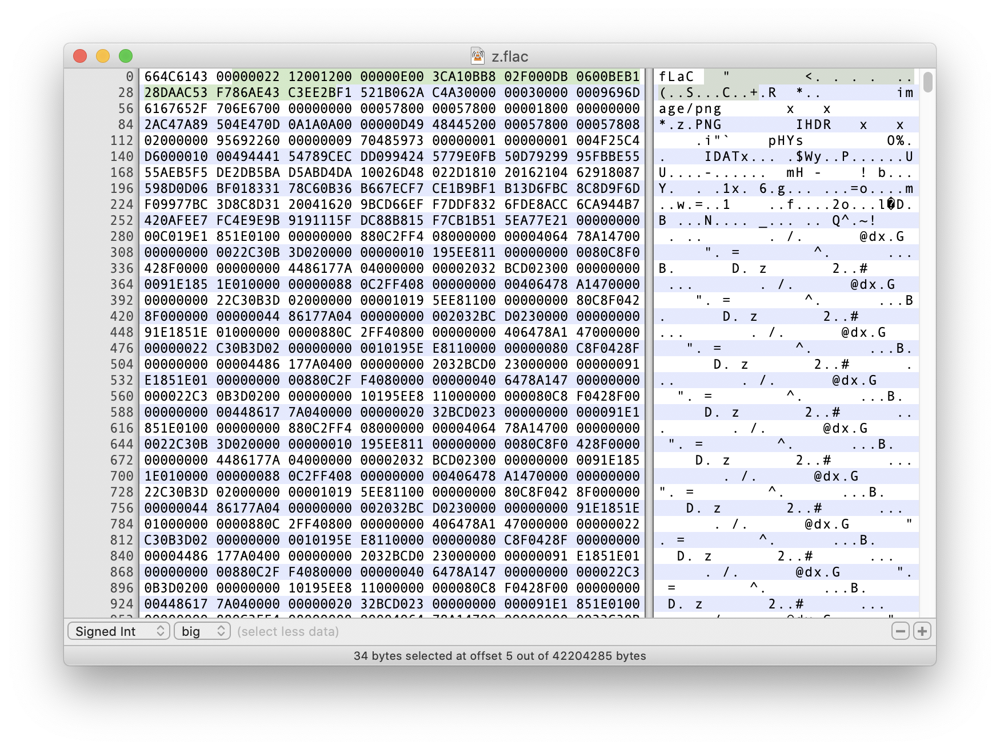

# FLAC 格式

[FLAC](https://xiph.org/flac/) 全名為 Free Loseless Audio Codec，是由 [Xiph.org](https://xiph.org/) 從 2001 年發展迄今的開放無損音訊格式。相對於 MP3 這些破壞性壓縮格式，所謂的無損（loseless），就是在壓縮的過程中並沒有破壞，我們將 PCM 格式轉換成 FLAC 格式之後，仍然可以將 FLAC 轉換回原本的 PCM 格式。許多平台上都內建了 FLAC codec，此外，我們也可以在網路上，找到 FLAC 的[程式碼](https://github.com/xiph/flac)，整合到我們的產品中。

FLAC 除了是一種 codec 之外，本身有一套自己的 container 格式，使用這種格式的 FLAC，叫做 plain FLAC，通常附檔名是 `.flac` 的檔案，就是這種。另外，也很常見到將 FLAC 資料包裝到 [OGG](https://en.wikipedia.org/wiki/Ogg) container 中，這樣的檔案叫做 Ogg FLAC，Xiph.org 也提供解析、播放 Ogg FLAC 的工具。

在 iOS/macOS 上，iOS 11 與 macOS 10.13 開始直接內建 FLAC codec，如果是更早的作業系統，就得要自己把 libFlac 打包到應用程式中。

## Plain FLAC Container

根據 [FLAC 規格](https://xiph.org/flac/format.html)，一個 FLAC 檔案是由以下成分所組成：

- FLAC 檔案的前四個 bytes，是 "fLaC" 四個字元。
- 在 "fLaC" 四個字元之後，會有多個 metadata block 組成，這些 metadata block 可以任意改變順序，但是需要標示，哪一個 metadata block 是最後一個 block。這些 block 的種類包括
  - Stream info：包括像是 sample rate 等用來讓 player 解析後面 data frame block 的資訊，一定要有這一段。代號 0。
  - Cue sheet：演出表，包括歌名、專輯，以及有哪些歌手在當中演出。非必要。代號 5。
  - Vorbis comment：一些註解欄位。非必要。代號 4。
  - Application：標示這個 FLAC 檔案是由哪個應用程式製作的。非必要。代號 2。
  - Picture：封面圖片。非必要。代號 6。
  - Seektable：就是在 frame block 區段的每個 block 的 offset，方便 client 找到 offset 時，可以快速 seek 到指定區段，像是我們在介紹 MP4 格式時講到的 `stsz`、`stco` 的用途。非必要。代號 3。
  - Padding：一些用來補足長度用的空資料。非必要。代號 1。
- Frame Block：基本上，雖然說用詞不同，但也就是我們在前面所說的 packet。Frame block 是由 frame header、footer 與 subframe 組成，在 frame header 的開頭一樣有 syncword，syncword 總共 14 的 bit，為 "11111111111110"。每個 FLAC 檔案中的 frame block 的大小可能是不同的，要根據 Stream info 當中的內容，才有辦法知道這個檔案中每個 frame block 的大小為何。

所以一個 FLAC 檔案中的資料大概如下圖：

## 實作 FLAC 檔案的分段載入

因為 FLAC 格式一樣是由連續的 packet 組成，所以我們還是可以從一個 FLAC 檔案的中間開始抓取、播放，我們也可以看到有 FLAC 格式的高音質網路廣播電台。不過，要能夠播放局部的 FLAC 資料，我們還是要補上最前方的 "fLaC" 四個字元，以及最少一個 metadata block：stream info。

想要提供給 player 一段 stream info，我們大概有幾種方式：1. 發送多個連線，先抓取 FLAC 檔案最前方一定數量的資料，然後丟給 player 解析、播放，不過，由於 metadata block 並不保證順序，所以我們其實無法正確預期 stream info 一定位在我們所抓取的範圍內。；2. 自己產生 stream info 區段的資料，不過，我們也不見得可以保證，這個 FLAC 檔案的格式，一定可以符合我們的預期。

如果我們想要自己產生 stream info，就得來了解這段資料的格式：stream info 的長度為 34 個 byte，裡頭的數字使用 Big endian 整數。包括：

- The minimum block siz (in samples) ，16 bits，必填
- The maximum block size (in samples) ，16 bits，必填
- The minimum frame size (in bytes) ，24 bits，可填零
- The maximum frame size (in bytes)，24 bits，可填零
- Sample Rate，20 bits，必填
- 聲道數 -1，FLAC 最多可以支援 8 個聲道，3 bits，必填
- 每個聲道所用 bits 數 -1，可為 4-32，5 bits，必填
- 整個檔案的 Sample 數量，36 bits，可填零
- MD5 checksum，128 bits，可填零

在 34 個 bytes 的前面，我們還要用一個 byte 表示這是一個 metadata block，其中第一個 bit 表示這是不是最後一個 metadata block，既然我們只想要一個 metadata block，那就填 1，剩下七個 bits 則用來表示 metadata block 的種類，stream info 的代號為 0，所以我們就填入 "10000000"。加上 "fLaC" 四個 bytes，我們總共要產生 39 個 bytes 的資料。

我們可以實際打開一個 FLAC 檔案看看：

我們可以看到，檔案開始的前 4 個 bytes，就是 "fLaC" 四個字，第五個 byte 為 0：第一個 bit 是 0，代表後面還有其他的 metadata block，另外 7 個 bits 也是 0，代表這段是 stream info，然後就是 34 個 bytes 的 stream info 的內容（圖片中被選取起來的地方）—不過，我們就得要讀出每個 bits，才能了解當中的意義了。至於 stream info 之後，是第二個 metadata block，我們可以判斷出，這邊放了一張封面圖片。

## FLAC 網路廣播電台

前面提到，網路上有使用 MP3 格式的網路廣播電台，而用戶可以隨時抓到一段資料就可以開始播放，是因為找到 syncword 之後，就可以解析出 packet，而 AAC 格式的網路廣播電台，則是使用 AAC ADTS container 格式。那，FLAC 格式呢？

FLAC 格式的高音質網路廣播電台，其實並沒有用到我們前面提到的這些自己產生 FLAC 檔頭的相關工作。我們可以看到的 FLAC 網路廣播，大概都被包裝在 OGG container 裡頭，而這種網路廣播的 server 軟體，像是 [icecast](http://icecast.org/)，在 client 端連上時，就會回應 OGG 的檔頭，讓 client 端知道如何解析接下來拿到的資料。
